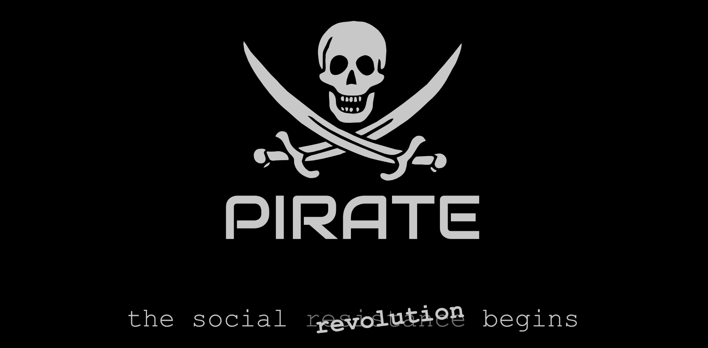
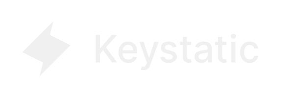

  
  

<!--   
 -->
  

<!-- https://github.com/user-attachments/assets/1f2cb472-cffe-4c51-ae21-c61a37003172 -->

  <strong align="center" style="font-size:30px">You're the Captain now!</strong>

<!-- 
PIRATE is a new social network with NO central control or ownership. It's based on leading Open-Source platforms and runs on individually owned websites.
 -->

<!-- 
PIRATE leverages the power of free services to host your own web app that you can control from any device, all for FREE!
 -->

<!-- 
Easily edit your homepage, update your profile, and publish engaging content on your OWN website/app.
 -->

<!-- 
PIRATE is also a complete website/web app platform with multimedia blog, that you can use however you wish. Completely configurable through the built in Content Management System.
 -->

PIRATE enables you to have YOUR OWN space on the web, where you can be confident that the content you produce is FULLY in your control. Twitter and other social media sites may change or come and go. With PIRATE, that doesn't matter - your content, is ALWAYS under your control.

PIRATE is built to operate using FREE Cloud Based Services. This means that your PIRATE account is basically free to operate month to month with no cost. You only pay a metered cost for what you use over the hosting providers generous limits.

<strong>PIRATE can be used on Netlify, Vercel, or Github</strong>

 
    <a href="https://pirateweb.org">View Demo</a>
    ☠️
    <a href="https://github.com/twilightscapes/pirate/issues/new?labels=bug&template=bug-report---.md">Report Bug</a>
    ☠️
    <a href="https://github.com/twilightscapes/pirate/issues/new?labels=enhancement&template=feature-request---.md">Request Feature</a>
  

 

# Install PIRATE &nbsp; | &nbsp; Quick Start

 

<!--  -->

## 🏴‍☠️ Web Features

- Next-Gen Social Media and Video Blogging Platform.
- User-installable and configurable PWA (Progressive Web Apps)
- Add / Modify / Delete pages and posts - no limitations.
- Edit website settings, seo settings, logos, etc all from within the CMS.
- Completely change the appearance with integrated css controls and custom css options
- SEO Optimized (Scores 100 on PageSpeed)
- Accessible, semantic HTML markup
- Resolution Independence - Works on all devices from phone to TV
- Dark / Light mode, using Tailwind and CSS variables
- Social media icons
- OpenGraph structured data
- Twitter Cards meta
- XML Sitemaps
- Built with Astro v4 🚀
- TailwindCSS Utility classes
- [Astro Assets Integration](https://docs.astro.build/en/guides/assets/) for optimised images with optional custom "blur up" loading effect
- Pagination and archives, including Tags. Offered with custom swipe/scroll orienation feature
- [Automatic RSS feed](https://docs.astro.build/en/guides/rss)
- Auto-generated [sitemap](https://docs.astro.build/en/guides/integrations-guide/sitemap/)
- [Pagefind](https://pagefind.app/) static search library integration
- [Astro Icon](https://github.com/natemoo-re/astro-icon) svg icon component
- [Keystatic CMS](https://keystatic.com) is integrated into and controls all aspects of your site.
- PiRATE Social features coming soon

## 🏴‍☠️ PIRATE Social

PIRATE is not your typical social network. It's a decentralized network of individualy owned personal websites acting together as a new social content distribution model.

Here's how it works: instead of relying on a central platform, PIRATE leverages the power of Netlify and GitHub to utelize their free services for hosting your own platorm. Your individual website becomes your hub for social interactions on both PIRATE and other social media. The content you produce, you fully own and control the rights to.

More than just a collection of individual websites, PIRATE uses the magic of RSS feeds, you can enjoy a central timeline that aggregates posts from across the network. You get to see what others are sharing, discover new voices, and engage in meaningful conversations.

Your PIRATE website is actually a Progressive Web App (PWA), which means you can access it seamlessly from any of your devices. Being a PWA also means there are no App Stores to worry about!

PIRATE gives you the tools to easily edit your homepage, update your profile, and publish engaging posts. It's super easy to get started, without any complicated technical barriers.

 
<h3>Technology Stack</h3>
PIRATE is built on industry leading technologies, and is designed from the ground up, using the best, most secure and modern development technology stack available today: <h3 style="font-size:30px;"><strong><i>T R A N G K</i></strong></h3>

  

## Setup

- With PIRATE, there is no need to muck around in code files just to configure and setup your site.
- All set up and control is done through the built-in CMS. 
- In order to to do so online, you will need to create a free account @ [KeyStatic Cloud](https://keystatic.cloud)
- Connect your Keystatic account to your Github repo
<!-- - Copy/paste the Keystatic project settings into your Netlify Env Variables -->
- Copy and Paste the Keystatic Cloud project settings you are given into this file:     [https://github.com/YourGitAccount/YourRepo/edit/main/keystatic.config.ts](https://github.com/piratesocial/pirate/edit/main/keystatic.config.ts)
Edit this file on line 7 - replace "pirate/pirate" with your project settings from Keystatic Cloud.
- Redeploy your site on Netlify and then go to yoursite.netlify.app/admin to login to the CMS and configure the rest of your site.

## Using Local Development

 You can edit and make updates through the cloud with the [KeyStatic](https://keystatic.com) CMS outlined above, or you can install it locally with the options listed below. You can use both and PIRATE will detect which one you are using: cloud or local.

## Commands
pnpm is recommended but you can also use npm, yarn, etc.

| Command          | Action                                                         |
| :--------------- | :------------------------------------------------------------- |
| `pnpm install`   | Installs dependencies                                          |
| `pnpm dev`       | Starts local dev server at `localhost:4321`                    |
| `ntl dev`        | Starts netlify dev server (req Netlify CLI) at `localhost:8888`                    |
| `pnpm build`     | Build your production site to `./dist/`                        |
| `pnpm postbuild` | Pagefind script to build the static search of your blog posts  |
| `pnpm preview`   | Preview your build locally, before deploying                   |
| `pnpm sync`      | Generate types based on your config in `src/content/config.ts` |
| `pnpm clean`      | Cleans and removes caches and all temp files |

## Acknowledgment

This theme was heavily inspired by [Astro Cactus](https://github.com/chrismwilliams/astro-theme-cactus/)

## 🏴‍☠️ Thank you

We really appreciate you choosing to become a PIRATE!

[PIRATE]: https://PIRATEweb.org
[Astro]: https://astro.build
[Keystatic]: https://keystatic.com

## License

MIT
